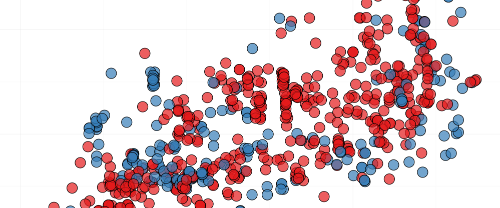

## Course Description

This course is targeted for Biostatistical techniques often employed in analytical tools for high throughput data and multivariate data. Participants can expect to attend a thorough set of lectures that will reveal the conceptual frameworks that are needed to understand the methods. Extensive hands-on practice will be the main vehicle for providing the skills and user independence. To keep things in context, the course is exclusively based on biological examples.
We will be using custom-built R scripts and packages that are available from the CRAN and/or Bioconductor repositories.
Care has been taken not to use any proprietary data or software, so that the hands-on experience can carry on after the course, providing maximum user independence. We will be using custom-built R scripts and packages that are available from the CRAN and Bioconductor repositories.

## Target Audience

Everybody using Bioinformatics methods is implicitly using statistical methods. Moreover, proper judgment of the results often calls for a deeper level of understanding than what is required to solve scholarly exercises.
We will look into particular areas such Simulation, Bayesian Inference, Hidden Markov Chains and Multivariate Data Analysis methods with the attitude, eyes and brains of an experienced statistician that wants to understand how the methods work and systematic way.

## Detailed Program

<table>
  <tbody>
    <tr>
      <th>Days</th>
      <th>Lectures</th>
      <th>Exercises & Script examples</th>
    </tr>
    <tr>
      <td><strong>Day 1</strong></td>
      <td>
        <ul>
          <li><a href="./assets/Day_1/probability_review2018.pdf">Quick Review of Statistical Concepts</a></li>
          <li><a href="./assets/Day_1/MC-and-B-2018.pdf">Monte Carlo and Bootstrap methods</a></li>
        </ul>
        <strong>Guides</strong>
        <ul>
          <li><a href="./assets/Day_1/r-cheat-sheet-3.pdf">R Cheat sheet</a></li>
          <li><a href="./assets/Day_1/Short-refcard.pdf">R Reference Card</a></li>
          <li><a href="./assets/Day_1/RDistributions">Probability Distributions in R</a></li>
        </ul>
      </td>
      <td>
        <ul>
          <li><a href="./pages/Day_1/Simulation.md">Probability Review (exercise)</a></li>
          <ul>
            <li>Random variables</li>
            <li>Parameters</li>
            <li>Discrete Distributions</li>
            <li>Continuous Distributions</li>
          </ul>
          <li><a href="./pages/Day_1/probreview.md">Simulation (exercise)</a></li>
          <ul>
            <li>Monte Carlo simulation</li>
            <li>Parametic/Non-parametric Boostrap estimation</li>
            <li>Boostrap Confidence Intervals</li>
            <li>Bootstrap Hypothesis Tests for one sample/two independent samples</li>
          </ul>
      </td>
    </tr>
    <tr>
      <td><strong>Day 2</strong></td>
      <td>
        <ul>
          <li><a href="./assets/Day_2/Slides_05 Bayesian Inference.pdf">Bayesian Inference</a></li>
          <li><a href="./assets/Day_2/Slides_06 Gibbs Sampling.pdf">Gibbs Sampling</a></li>
          <li><a href="./assets/Day_2/Slides_07 Expectation Maximization.pdf">Expectation-Maximization algorithm</a></li>
        </ul>
      </td>
      <td>
        <ul>
          <li>Baseyian Inference</li>
          <ul>
            <li><a href="./pages/Day_2/Script_Examples_05_Bayesian_Inference.R">Scipt example</a></li>
          </ul>
          <li><a href="./pages/Day_2/Exercise_06_Gibbs_Sampling.md">Gibbs Sampling (exercise)</a></li>
          <ul>
            <li><a href="./pages/Day_2/Script_Examples_06 Gibbs Sampler.R">Scipt example</a></li>
          </ul>
          <li><a href="./pages/Day_2/Exercise_07_EM_Algorithm.md">Expectation-Maximization algorithm (exercise)</a></li>
          <ul>
            <li><a href="./pages/Day_2/Script_Examples_07 Expectation Maximization.r">Scipt example</a></li>
          </ul>
        </ul>
      </td>
    </tr>
    <tr>
      <td><strong>Day 3</strong></td>
      <td>
        <ul>
          <li><a href="./assets/Day_3/PCA2018.pdf">Principal Component Analysis</a></li>
          <li>Multiple Testing</li>
          <ul>
            <li><a href="./assets/Day_3/Slides_09_Multiple_Testing.pdf">Long Version</a></li>
            <li> <a href="./assets/Day_3/Slides_09_Multiple_Testing.pdf">Short Version</a></li>
          </ul>
        </ul>
      </td>
      <td>
        <ul>
          <li><a href="./pages/Day_3/PCA.md">Principal Component Analysis (exercise)</a></li>
          <ul>
            <li><a href="./pages/Day_3/PCAR.R">Scipt example</a></li>
          </ul>
          <li><a href="./pages/Day_3/Exercises_09 Multiple Testing.pdf">Multiple testing (exercise)</a></li>
          <ul>
            <li><a href="./pages/Day_3/Script_Exercises_09 Multiple Testing.R">Script exercises</a></li>
            <li><a href="./pages/Day_3/Script_Example_09 Multiple Testing.R">Script examples</a></li>
          </ul>
        </ul>
      </td>
    </tr>
    <tr>
      <td><strong>Day 4</strong></td>
      <td></td>
      <td>
        <ul>
          <li><a href="./pages/Day_4/Project_EM_Algorithm_2018.pdf">Project Expectation-Maximization (exercise)</a></li>
          <li><a href="./pages/Day_4/ProjecT_ PCA_and_Bootstrap2_2018.pdf">Project Principal Component and Bootstrap2 (exercise)</a></li>
        </ul>
      </td>
    </tr>
  </tbody>
</table>

---

### [Course Pre-requisites](pages/objectives_prerequisites.md)

### [Instructors](pages/instructors.md)

---

The source for this course webpage is [on github](https://github.com/GTPB/ABSTAT18).
